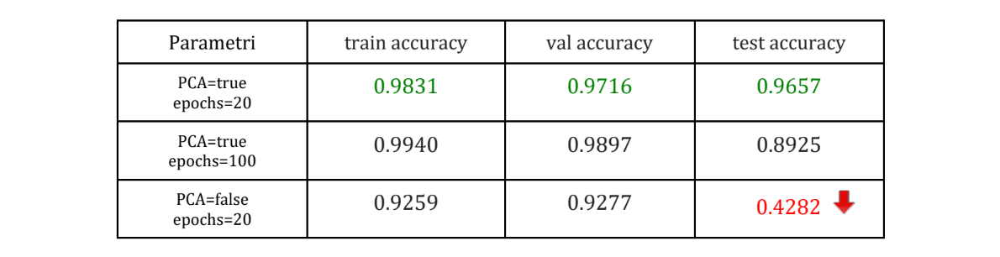
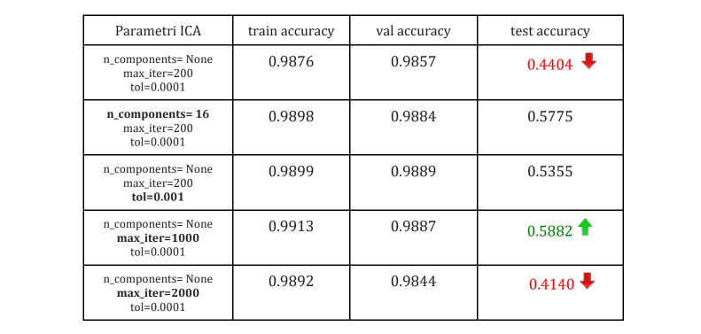
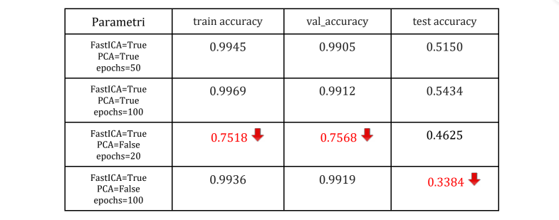

# Tirocinio/Tesi_Triennale
Progetto di tirocinio e tesi sperimentale per la Laurea Triennale di Ingegneria Elettronica all'Università Politecnica delle Marche.

## ***Ottimizzazione di una rete neurale ricorrente per la classificazione di pazienti affetti da Alzheimer tramite pre-processamento del segnale EEG***🧠
C'è un crescente interesse della ricerca nell'utilizzo dell'elettroencefalogramma (EEG) come strumento di diagnosi non invasivo per le malattie neurodegenerative come l'Alzheimer (Alzheimer’s Disease, AD). L'EEG misura l'attività elettrica cerebrale e può identificare anomalie nelle onde cerebrali legate a determinati disturbi. Gli algoritmi di Deep Learning hanno dimostrato di avere la capacità di estrarre informazioni rilevanti dal segnale EEG chiamate “features” e grazie a queste caratteristiche, sono in grado di distinguere automaticamente i pazienti sani da quelli affetti da AD, dopo essere state adeguatamente implementate e addestrate.

## Obiettivo
L’attività principale del tirocinio è stata quella di analizzare l’architettura di una rete neurale già implementata, per aggiungere un ulteriore preprocessing dei dati al fine di migliorare i risultati del modello. La rete è stata addestrata a distinguere un paziente sano da uno malato utilizzando un dataset ottenuto dalle analisi EEG di 35 pazienti, 20 affetti da Alzheimer e 15 sani. Questi dati provengono dal Dipartimento di Medicina Sperimentale e Clinica di Ancona. 

## Strumenti Utilizzati
- EDFbrowser
- Google Collaboratory
- Librerie di Python:
  - Numpy
  - Matplotlib
  - SciPy 
  - Scikit-learn*
  - TensorFlow
- EEGLAB
  - BioSignal Toolbox

_*La funzione principale presa dalla libreria Scikit-learn è FastICA: un algoritmo veloce per eseguire l'analisi indipendente dei componenti (ICA, Independent Component Analysis), utilizzata per la pre-elaborazione dei segnali:_

```
transformer= sklearn.decomposition.FastICA(n_components=None, algorithm='parallel', whiten='arbitrary-variance', 
                                             fun='cube',fun_args=None, max_iter=1000, tol=0.0001,
                                              w_init=None, whiten_solver='eigh', random_state=None)
```
```
eeg= transformer.fit_transform(eeg)
```


## Formato del dataset
Il dataset a disposizione è costituito dai segnali EEG di 35 pazienti, 20 affetti da Alzheimer (AD) e 15 sani (N). 
- [x] I dati sono stati forniti in formato **EDF** (European Data Format), un formato utilizzato in ambito medico per lo scambio e l'archiviazione di segnali biologici.
- [x] A partire dal formato EDF iniziale, è stato fatto un preprocessing iniziale in cui i dati sono stati salvati in formato **NPY**. Un file NPY è un file di array NumPy creato con la libreria NumPy di Python. Il file NPY memorizza tutte le informazioni necessarie per ricostruire correttamente l’array.
- [x] Per ogni segnale, inoltre, è stato creato un file in formato **NPZ** (NumPy Zipped Data), cioè un file zip contenente più file NPY, uno per ogni array.
- [x] Il passo successivo è applicare le funzioni dell’EEGLAB ai segnali del dataset per eliminarne le distorsioni, quindi è necessario convertire il formato NPZ in formati supportati dall’EEGLAB; per questo progetto sono stati scelti i formati **MAT** e **CSV**.


## Risultati finali
- Rete di partenza senza ICA:



- Rete con algoritmo FastICA:


...

- Rete con parametri modificati (PCA e numero di epoche) e algoritmo FastICA con parametri di default:



## Analisi dei risultati ottenuti 
- Nella [Tab.1](img/tab1.png) sono riportati in verde i valori ottimali, raggiunti con la rete di partenza senza ICA, con l’algoritmo della PCA e con un adeguato numero di epoche. L’obiettivo è quello di raggiungere risultati migliori aggiungendo un ulteriore preprocessing sui dati, cioè l’ICA.
- Come si vede dalla [Tab.2](img/tab2.png), però, l’ICA porta a un crollo del valore della test accuracy, mentre la train e val accuracy restano invariate. Ho eseguito diverse prove modificando i parametri della funzione FastICA, ma la test accuracy non migliora. Con i valori di default l’ICA non converge. Con tol=0,001 scompare il warning sulla non convergenza dell’ICA, ma si abbassa ulteriormente la val accuracy. Il valore migliore con l’ICA si ottiene portando il numero di iterazioni a 1000.
- Nella [Tab.3](img/tab3.png)  invece ho modificato i parametri della rete, provando a non eseguire la PCA e aumentando il numero di epoche. Un'epoca consiste in un ciclo completo di allenamento sul train set. Una volta che tutti i campioni del set sono stati visti, la rete ricomincia, segnando l'inizio della 2° epoca. Quindi all’aumentare del numero di epoche, il modello sarà più allenato nella predizione dei risultati, ma il rischio è quello di un overfitting: una scarsa capacità di adattamento a nuovi dati mai visti prima. Questo potrebbe essere il motivo per cui, aumentando il numero di epoche il modello non diventa più preciso ma, come si vede dalla Tab. 3, la test accuracy diminuisce ancora.

